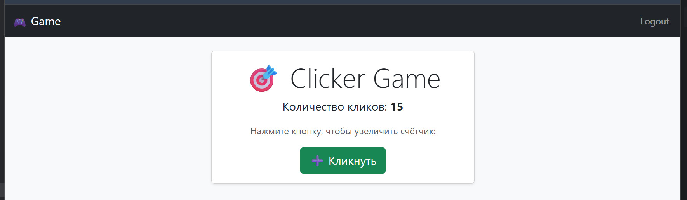

# 🎯 Clicker Game (Flask)

Простая браузерная игра на Flask, в которой пользователи могут входить в систему и увеличивать свой счётчик кликов. Данные сохраняются в аккаунте — у каждого пользователя свой результат!



---

## 🚀 Функционал

- 🔐 Регистрация и вход в аккаунт
- 📈 Индивидуальный счётчик кликов
- 💾 Сохранение количества кликов в базе данных
- 🎨 Современный интерфейс с Bootstrap 5
- 🧠 Разметка с использованием Jinja2 (Flask templates)

---

## 🧩 Технологии

- [Flask](https://flask.palletsprojects.com/)
- [Flask-Login](https://flask-login.readthedocs.io/)
- [Flask-WTF](https://flask-wtf.readthedocs.io/)
- [SQLite](https://sqlite.org/index.html)
- [Bootstrap 5](https://getbootstrap.com/)

---

## 🗂 Структура проекта
- clicker-app/
- ├── app/
- │ ├── init.py # Инициализация приложения
- │ ├── models.py # Модель пользователя
- │ ├── forms.py # WTForms для login/register/account
- │ ├── routes.py # Основные маршруты
- │ └── templates/
- │     ├── base.html # Общий шаблон
- │     ├── login.html
- │     ├── register.html
- │     ├── account.html
- │     └── index.html # Clicker
- ├── static/ # (опционально: CSS, иконки)
- ├── main.py # Точка входа
- ├── requirements.txt
- ├── README.md
- └── .gitignore

---

## ⚙️ Установка
🔻 Клонировать проект:

```bash
git clone https://github.com/AlexaPan/VD09.git
cd clicker-game
```
---
## 👤 Авторизация
- Пользователь может зарегистрироваться и войти в систему
- После входа — он видит личный счётчик кликов
Каждое нажатие на кнопку увеличивает значение, которое сохраняется в базе

## 🔐 Приватность
- Все данные (имя пользователя, клики, пароль) сохраняются локально. Пароль хешируется (через Werkzeug/Flask).